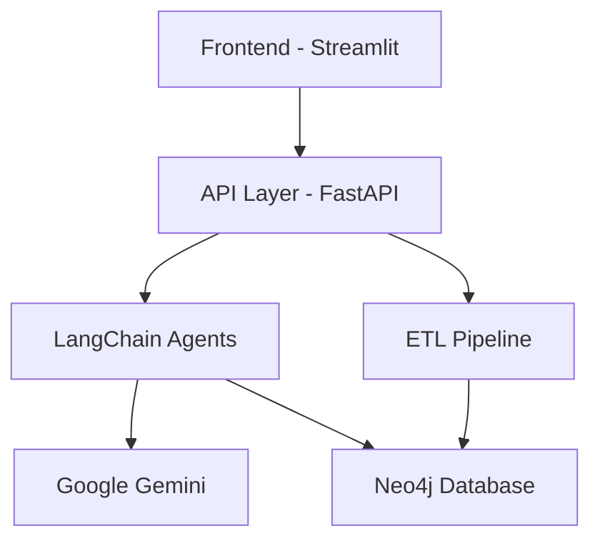

<div align="center">

# 🏥 Hospital System RAG Chatbot


_Một chatbot thông minh tích hợp LangChain, Neo4j và Google Gemini để tương tác với hệ thống bệnh viện_

[English](README_EN.md) | Tiếng Việt

</div>

## 📑 Mục lục

- [Tổng quan](#-tổng-quan)
- [Tính năng](#-tính-năng)
- [Kiến trúc hệ thống](#-kiến-trúc-hệ-thống)
- [Công nghệ sử dụng](#-công-nghệ-sử-dụng)
- [Cài đặt và Chạy](#-cài-đặt-và-chạy)
- [Cấu trúc dự án](#-cấu-trúc-dự-án)
- [API Documentation](#-api-documentation)
- [Môi trường và Cấu hình](#-môi-trường-và-cấu-hình)
- [Docker Deployment](#-docker-deployment)
- [Testing](#-testing)
- [Contributing](#-contributing)
- [License](#-license)

## 🌟 Tổng quan

Hospital System RAG Chatbot là một hệ thống chatbot thông minh được xây dựng để hỗ trợ việc truy vấn và phân tích thông tin trong hệ thống bệnh viện. Dự án sử dụng kiến trúc RAG (Retrieval-Augmented Generation) kết hợp với LangChain và Google Gemini để tạo ra trải nghiệm tương tác tự nhiên và chính xác.

### Ưu điểm nổi bật:

- 🤖 Tương tác tự nhiên với ngôn ngữ người dùng
- 📊 Phân tích dữ liệu thời gian thực
- 🔄 Tích hợp đa nguồn dữ liệu
- 🛡️ Bảo mật và kiểm soát truy cập
- 📈 Khả năng mở rộng cao

## 💫 Tính năng

### 1. Quản lý thông tin bệnh viện

- Tra cứu thông tin chi tiết bệnh viện
- Theo dõi công suất và tình trạng hoạt động
- Phân tích số liệu thống kê

### 2. Quản lý bác sĩ và nhân viên

- Tra cứu thông tin và lịch làm việc
- Đánh giá hiệu suất và phản hồi
- Phân tích chuyên môn và kinh nghiệm

### 3. Quản lý bệnh nhân

- Tra cứu lịch sử khám chữa bệnh
- Theo dõi chi phí và bảo hiểm
- Phân tích mô hình bệnh tật

### 4. Phân tích và báo cáo

- Thống kê thời gian chờ
- Phân tích chi phí và doanh thu
- Báo cáo đánh giá chất lượng

## 🏗 Kiến trúc hệ thống



## 🛠 Công nghệ sử dụng

### Backend

- **FastAPI**: Framework API hiệu năng cao
- **LangChain**: Framework xử lý ngôn ngữ tự nhiên
- **Google Gemini**: Mô hình ngôn ngữ lớn
- **Neo4j**: Cơ sở dữ liệu đồ thị
- **Python 3.11**: Ngôn ngữ lập trình

### Frontend

- **Streamlit**: Framework UI cho Python
- **Streamlit Components**: Custom widgets
- **HTML/CSS/JavaScript**: Giao diện người dùng

### DevOps & Tools

- **Docker**: Container hóa
- **Git**: Quản lý mã nguồn
- **Poetry**: Quản lý dependencies
- **pytest**: Unit testing
- **GitHub Actions**: CI/CD

## 📦 Cài đặt và Chạy

### Yêu cầu hệ thống

- Python 3.11+
- Docker và Docker Compose
- Neo4j Database
- Google Cloud Account (cho Gemini API)

### Cài đặt thông thường

1. Clone repository:

```bash
git clone https://github.com/yourusername/hospital-rag-chatbot.git
cd hospital-rag-chatbot
```

2. Tạo môi trường ảo:

```bash
python -m venv venv
source venv/bin/activate  # Linux/Mac
venv\Scripts\activate     # Windows
```

3. Cài đặt dependencies:

```bash
pip install -r requirements.txt
```

4. Thiết lập môi trường:

```bash
cp .env.example .env
# Cập nhật các biến môi trường trong file .env
```

5. Chạy ứng dụng:

```bash
# Terminal 1 - API
uvicorn chatbot_api.src.main:app --reload --port 8000

# Terminal 2 - Frontend
streamlit run chatbot_frontend/src/main.py
```

### Cài đặt với Docker

1. Build các containers:

```bash
docker-compose build
```

2. Chạy hệ thống:

```bash
docker-compose up -d
```

3. Kiểm tra logs:

```bash
docker-compose logs -f
```

## 📁 Cấu trúc dự án

```
hospital-rag-chatbot/
├── chatbot_api/                 # Backend service
│   ├── src/
│   │   ├── main.py             # Entry point
│   │   ├── agents/             # LangChain agents
│   │   │   ├── hospital.py     # Hospital agent
│   │   │   ├── cypher.py       # Cypher generation
│   │   │   └── qa.py           # Q&A processing
│   │   ├── models/            # Data models
│   │   └── utils/             # Utilities
│   ├── tests/                 # API tests
│   ├── Dockerfile            # API container
│   └── pyproject.toml        # Dependencies
│
├── chatbot_frontend/          # Frontend service
│   ├── src/
│   │   ├── main.py           # Main UI
│   │   ├── components/       # UI components
│   │   └── utils/           # Frontend utilities
│   ├── Dockerfile           # Frontend container
│   └── pyproject.toml       # Dependencies
│
├── hospital_neo4j_etl/       # ETL service
│   ├── src/
│   │   ├── main.py          # ETL process
│   │   └── utils/          # ETL utilities
│   ├── Dockerfile          # ETL container
│   └── pyproject.toml      # Dependencies
│
├── data/                    # Sample data
├── docs/                    # Documentation
├── tests/                   # Integration tests
├── .env.example            # Environment template
├── docker-compose.yml      # Container orchestration
├── requirements.txt        # Project dependencies
└── README.md              # Project documentation
```

## 📚 API Documentation

API documentation có sẵn tại các endpoints:

- Swagger UI: `http://localhost:8000/docs`
- ReDoc: `http://localhost:8000/redoc`

### Các endpoint chính:

#### Hospital RAG Agent

```http
POST /hospital-rag-agent
```

- Xử lý câu hỏi về thông tin bệnh viện
- Hỗ trợ phân tích và trả lời tự nhiên

#### Cypher Generation

```http
POST /generate-cypher
```

- Tạo câu truy vấn Cypher từ câu hỏi
- Tối ưu hóa truy vấn tự động

#### Question Answering

```http
POST /qa
```

- Trả lời câu hỏi dựa trên dữ liệu
- Tích hợp nhiều nguồn thông tin

## ⚙️ Môi trường và Cấu hình

### Biến môi trường

```env
# Neo4j Configuration
NEO4J_URI=neo4j+s://xxx.databases.neo4j.io
NEO4J_USERNAME=neo4j
NEO4J_PASSWORD=your-password
AURA_INSTANCEID=instance-id
AURA_INSTANCENAME=instance-name

# Google API
GOOGLE_API_KEY=your-api-key

# Model Configuration
HOSPITAL_AGENT_MODEL=gemini-2.0-flash
HOSPITAL_CYPHER_MODEL=gemini-2.0-flash
HOSPITAL_QA_MODEL=gemini-2.0-flash

# Data Sources
HOSPITALS_CSV_PATH=path/to/hospitals.csv
PHYSICIANS_CSV_PATH=path/to/physicians.csv
PATIENTS_CSV_PATH=path/to/patients.csv
```

## 🐳 Docker Deployment

### Production Deployment

1. Build production images:

```bash
docker-compose -f docker-compose.prod.yml build
```

2. Deploy services:

```bash
docker-compose -f docker-compose.prod.yml up -d
```

### Scaling Services

```bash
# Scale API service
docker-compose up -d --scale api=3

# Scale ETL workers
docker-compose up -d --scale etl=2
```

## 🧪 Testing

### Unit Tests

```bash
# Run all tests
pytest

# Run specific test file
pytest tests/test_hospital_agent.py

# Run with coverage
pytest --cov=chatbot_api
```

### Integration Tests

```bash
# Run integration tests
pytest tests/integration/
```

## 🤝 Contributing

Chúng tôi hoan nghênh mọi đóng góp! Xem [CONTRIBUTING.md](CONTRIBUTING.md) để biết thêm chi tiết.

### Quy trình đóng góp:

1. Fork repository
2. Tạo branch mới (`git checkout -b feature/AmazingFeature`)
3. Commit changes (`git commit -m 'Add some AmazingFeature'`)
4. Push to branch (`git push origin feature/AmazingFeature`)
5. Tạo Pull Request

## 📄 License

Dự án được phân phối dưới giấy phép MIT. Xem `LICENSE` để biết thêm thông tin.

## 👥 Authors

- **Lê Huy Hồng Nhật** - [GitHub](https://github.com/LeHuyHongNhat)

## 📧 Contact

Lê Huy Hồng Nhật - [@LeHuyHongNhat](https://github.com/LeHuyHongNhat)

Project Link: [https://github.com/LeHuyHongNhat/hospital-rag-chatbot](https://github.com/LeHuyHongNhat/hospital-rag-chatbot)

---

<div align="center">

### ⭐ Nếu dự án này hữu ích, hãy cho nó một ngôi sao! ⭐

</div>
